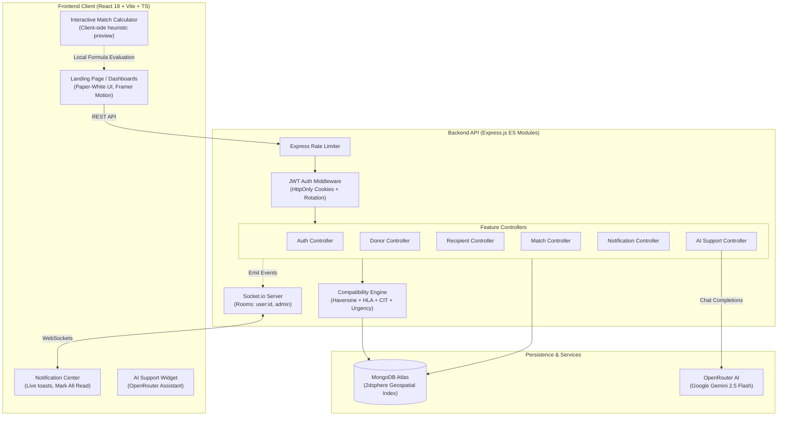

# 🔗 LifeLink: AI-Enabled Real-Time Organ Donation Matching Platform

[](https://nodejs.org/)
[](https://expressjs.com/)
[](https://react.dev/)
[](https://www.typescriptlang.org/)
[](https://vitejs.dev/)
[](https://tailwindcss.com/)
[](https://www.mongodb.com/atlas)
[](https://socket.io/)
[](https://jestjs.io/)
[](https://opensource.org/licenses/MIT)

LifeLink is an open-source, production-grade clinical-eligibility matching and real-time coordination platform that connects organ donors with compatible recipients. Designed with strict biological criteria, medical urgency indexes, and Cold Ischemia Time (CIT) transport constraints, the system automates matching scores, manages credential verification workflows, and coordinates interactions through socket-driven instant notifications.

---

## 📑 Table of Contents

- [Overview & Mission](#-overview--mission)
- [System Architecture](#-system-architecture)
- [Key Features & Capabilities](#-key-features--capabilities)
  - [1. Real-Time Compatibility Engine](#1-real-time-compatibility-engine)
  - [2. Interactive Match Simulator & Calculator](#2-interactive-match-simulator--calculator)
  - [3. Document Verification Desk](#3-document-verification-desk)
  - [4. AI Clinical Support Assistant](#4-ai-clinical-support-assistant)
  - [5. Socket-Driven Notification Center](#5-socket-driven-notification-center)
  - [6. Coordinator Messaging Channel](#6-coordinator-messaging-channel)
  - [7. Warm Paper-White Visual Identity](#7-warm-paper-white-visual-identity)
- [Technical Stack](#-technical-stack)
- [Repository Directory Structure](#-repository-directory-structure)
- [Local Development & Setup](#-local-development--setup)
  - [Prerequisites](#1-prerequisite-checklist)
  - [Environment Configuration](#2-environment-configuration)
  - [Running the Application](#3-spin-up-services)
- [REST API Reference](#-rest-api-reference)
- [Testing & Quality Assurance](#-testing--quality-assurance)
- [Docker Deployment](#-docker-deployment)
- [Security & Compliance Highlights](#-security--compliance-highlights)
- [Contributing & License](#-contributing--license)

---

## 🎯 Overview & Mission

Transplant logistics operate within unforgiving physiological windows: ischemic preservation clocks start the moment an organ is retrieved. Incompatible blood grouping, HLA allele mismatches, or geographic delays can jeopardize transplant success.

LifeLink addresses these bottlenecks by:
1. **Eliminating Cold Ischemia Failures:** Automatically rejecting match pairs where transit distance exceeds the biological viability window of the organ.
2. **Automating Complex Immunology Checks:** Enforcing Rh-aware blood typing and calculating mismatch counts across 6 HLA loci (A, B, DR).
3. **Equitable Prioritization:** Factoring patient medical urgency and waitlist tenure into scoring.
4. **Real-Time Logistics Alerting:** Instantly dispatching match alerts and document status updates through WebSocket rooms.

---

## 🏛️ System Architecture



---

## ⚡ Key Features & Capabilities

### 1. Real-Time Compatibility Engine
Matches are ranked dynamically on a scale of `0` to `100` based on a multi-tier clinical medical scoring rubric:

$$\text{Score} = 0.20 \times \text{Blood} + 0.30 \times \text{Urgency} + 0.20 \times \text{Distance} + 0.20 \times \text{HLA} + 0.05 \times \text{Size} + 0.05 \times \text{Age}$$

* **Blood Group Compatibility (20%):** Enforces strict Rh-aware compatibility mapping (`O-` universal donor, `AB+` universal recipient). Exact matches score 100; compatible non-identical score 50; incompatible pairings are rejected (`null`).
* **Medical Urgency & Waitlist Seniority (30%):** Clinical severity assigns baseline points: `CRITICAL` (100), `HIGH` (75), `MEDIUM` (50), `LOW` (25). A seniority bonus awards +1 point for every 30 days on the waiting list (capped at 10 points).
* **Geographical Proximity & Cold Ischemia Time Limits (20%):** Enforces organ-specific travel distance limits:
  * **Heart / Lung:** 400 km (~4 hours CIT limit)
  * **Liver / Pancreas:** 1200 km (~12 hours CIT limit)
  * **Kidney:** 2000 km (~24-36 hours CIT limit)
  * Pairs exceeding the CIT limit return `null` immediately. Distance scores scale linearly from 100 down to 0 at the threshold.
* **HLA Tissue Typing Match Quality (20%):** Evaluates mismatches (0 to 6) across Locus A (`a1, a2`), Locus B (`b1, b2`), and Locus DR (`dr1, dr2`): $\text{HLA Score} = 100 \times (1 - \frac{\text{mismatches}}{6})$.
* **Weight/Size Ratio (5%):** Ratios within $[0.8, 1.2]$ receive 100 points, with linear reduction outside the ideal range.
* **Age Compatibility (5%):** Prioritizes age-appropriate pairings. Drops 3 points per year of age difference: $\max(0, 100 - 3 \times \Delta\text{Age})$.

### 2. Interactive Match Simulator & Calculator
Accessible directly on the landing page, allowing coordinators, medical staff, and patients to simulate matches in real time:
* Test pairings across any organ type, donor/recipient blood types, distances, HLA loci, age, and weight.
* Provides real-time rejection alerts with explicit clinical reasoning (e.g. *Blood Type Mismatch* or *Cold Ischemia Limit Exceeded*).
* Visual itemized progress bars detailing the contribution of each rubric component toward the final score.

### 3. Document Verification Desk
* **Upload Pipelines:** Donors upload identity proof and medical eligibility forms; recipients submit medical referral documentation.
* **Admin Verification Queue:** Hospital administrators review, approve, or reject submissions with custom reasons (e.g., "Illegible scan").
* **Active Status Guards:** Donors are only activated when consent is explicitly confirmed and at least one document has been verified.

### 4. AI Clinical Support Assistant
* **Embedded Support Widget:** Persistent floating assistant accessible across all user and admin dashboards.
* **Powered by OpenRouter:** Configured to run `google/gemini-2.5-flash` with platform-specific clinical context, rules, and guidance.
* **Safety & Credit Safeguards:** Includes strict prompt boundary rules (redirects medical advice to physicians) and `max_tokens: 1000` to prevent token overrun.

### 5. Socket-Driven Notification Center
* **Instant Match & Status Notifications:** Socket.io delivers alerts when a new match is registered or when document review decisions are made.
* **State Persistence:** Notifications are stored in MongoDB.
* **One-Click "Mark All as Read":** Quick action button and backend endpoint (`PATCH /api/v1/notifications/mark-all-read`) to update all unread notifications instantly.

### 6. Coordinator Messaging Channel
* **Direct Communication:** Recipients can message transplant coordinators directly regarding their waitlist status or clinical questions.
* **Lifecycle Tracking:** Tracks queries through `PENDING` and `RESOLVED` states with full audit trails.

### 7. Warm Paper-White Visual Identity
LifeLink utilizes a humanist, clinical-grade interface designed to prioritize visual clarity and reduce cognitive fatigue:
* **Canvas Background:** `#FBFAF7` (warm paper-white) for a clean, non-sterile appearance.
* **Primary Accent:** Pine Teal (`#1F6F5C`) for action indicators and primary highlights.
* **Clinical Badges:** Urgency status tags (Teal for medium, Amber for high, Red for critical).
* **Smooth Motion:** GSAP scroll-triggered heartbeat lines, 3D card tilt effects, and interactive accordion panels.

---

## 🏗️ Technical Stack

| Layer | Technologies |
| :--- | :--- |
| **Frontend** | React 18, TypeScript, Vite, TailwindCSS, Framer Motion, GSAP, React Hook Form, Lucide React, Socket.io Client |
| **Backend** | Node.js (ES Modules), Express.js, Socket.io, Zod, Pino, Pino-Http, Express Rate Limit, Helmet, Cookie-Parser, Bcrypt |
| **Database** | MongoDB Atlas, Mongoose (Geospatial `$geoNear` / 2dsphere indexes) |
| **AI Integration** | OpenRouter API (`google/gemini-2.5-flash`) |
| **Testing** | Jest (`--experimental-vm-modules`), Supertest, Vitest, Testing Library |
| **DevOps** | Docker, Nodemon, ESLint, Prettier, Cross-Env |

---

## 📁 Repository Directory Structure

```
LifeLink/
├── backend/
│   ├── src/
│   │   ├── config/              # Environment config, DB connection, Pino logger
│   │   ├── middleware/          # Rate limiting, JWT authentication guard, error handling
│   │   ├── features/
│   │   │   ├── admin/           # Admin verification queues & stats
│   │   │   ├── auth/            # JWT authentication, session handling, user models
│   │   │   ├── donor/           # Donor profile models, schemas, and services
│   │   │   ├── recipient/       # Recipient profiles, urgency audits, messaging
│   │   │   ├── matches/         # Matching engine, match schema, CIT evaluation
│   │   │   ├── notifications/   # Notification controller, mark-all-read routes
│   │   │   └── support/         # AI Support Assistant controller (OpenRouter)
│   │   ├── socket/              # Socket.io authentication & event routing
│   │   ├── utils/               # ApiError, ApiResponse, asyncHandler utilities
│   │   ├── app.js               # Express application router configuration
│   │   └── server.js            # HTTP and WebSocket server bootstrap
│   ├── tests/
│   │   ├── unit/                # Isolated matching engine heuristic unit tests
│   │   ├── integration/         # REST API endpoint integration tests
│   │   └── setup.js             # Test database isolation configuration
│   ├── Dockerfile
│   └── package.json
│
├── frontend/
│   ├── src/
│   │   ├── components/          # Tilt cards, BookFlip, NotificationCenter, SupportChat
│   │   ├── context/             # AuthContext session provider
│   │   ├── pages/               # LandingPage, Donor/Recipient/Admin Dashboards, Auth
│   │   ├── types/               # TypeScript interfaces & API contract types
│   │   ├── utils/               # fetchClient with token refresh interceptor
│   │   ├── App.tsx              # React Router layout registry
│   │   └── main.tsx             # Application mount point
│   ├── index.html
│   ├── package.json
│   ├── tailwind.config.js
│   └── vite.config.ts
│
├── API.md                       # Complete REST API & WebSocket documentation
└── README.md                    # Project documentation
```

---

## 🛠️ Local Development & Setup

### 1. Prerequisite Checklist
* **Node.js**: v20.0.0 or higher
* **npm**: v10.0.0 or higher
* **MongoDB**: A running MongoDB instance or a free MongoDB Atlas connection URI

### 2. Environment Configuration

Create a `.env` file in the `backend/` directory:

```ini
PORT=5000
NODE_ENV=development
MONGODB_URI=mongodb+srv://<username>:<password>@cluster.mongodb.net/lifelink?retryWrites=true&w=majority
JWT_ACCESS_SECRET=your_super_secret_access_key_longer_than_32_characters
JWT_REFRESH_SECRET=your_super_secret_refresh_key_longer_than_32_characters
COOKIE_SECRET=your_super_secret_cookie_signing_key_32_chars
CORS_ORIGIN=http://localhost:5173
OPENROUTER_API_KEY=your_openrouter_api_key_here
SUPPORT_MODEL=google/gemini-2.5-flash
```

### 3. Spin Up Services

#### Start Backend API & Socket Server:
```bash
cd backend
npm install
npm run dev
```
> The API server will listen on `http://localhost:5000`.

#### Start Frontend Client:
```bash
cd frontend
npm install
npm run dev
```
> The Vite development server will open at `http://localhost:5173`.

---

## 📡 REST API Reference

For detailed request and response contracts, consult [API.md](file:///d:/LifeLink/API.md). Below is a summary of primary endpoints:

| Feature | Method | Endpoint | Description | Access |
| :--- | :--- | :--- | :--- | :--- |
| **Auth** | `POST` | `/api/v1/auth/register` | Register new donor, recipient, or admin | Public |
| **Auth** | `POST` | `/api/v1/auth/login` | Login and receive signed HttpOnly JWT cookies | Public |
| **Auth** | `POST` | `/api/v1/auth/logout` | Clear session cookies | Authenticated |
| **Auth** | `GET` | `/api/v1/auth/me` | Fetch active authenticated user profile | Authenticated |
| **Donor** | `POST` | `/api/v1/donors/profile` | Create or update donor clinical profile | Donor |
| **Donor** | `POST` | `/api/v1/donors/documents` | Upload donor verification document | Donor |
| **Recipient** | `POST` | `/api/v1/recipients/profile` | Create or update recipient clinical profile | Recipient |
| **Recipient** | `POST` | `/api/v1/recipients/inquire` | Send inquiry to transplant coordinator | Recipient |
| **Matches** | `GET` | `/api/v1/matches/my-matches` | Retrieve scored matches for active user | Donor / Recipient |
| **Matches** | `PATCH` | `/api/v1/matches/:id/respond` | Accept or decline a match proposal | Donor / Recipient |
| **Matches** | `GET` | `/api/v1/matches/admin` | Paginated listing of all platform matches | Admin |
| **Notifications** | `GET` | `/api/v1/notifications` | Get recent user notifications | Authenticated |
| **Notifications** | `PATCH` | `/api/v1/notifications/:id/read` | Mark single notification as read | Authenticated |
| **Notifications** | `PATCH` | `/api/v1/notifications/mark-all-read` | Mark all user notifications as read | Authenticated |
| **Support** | `POST` | `/api/v1/support/chat` | Send prompt to AI clinical support bot | Public / Auth |

---

## 🧪 Testing & Quality Assurance

### Run Backend Unit Tests (Compatibility Engine)
Unit tests test the heuristic calculations, Haversine fallback, HLA mismatch counts, and CIT limit rejections without requiring a database connection:
```bash
cd backend
npx cross-env NODE_OPTIONS="--experimental-vm-modules" jest tests/unit --runInBand --forceExit
```

### Run Full Test Suite
Runs unit and integration tests against the isolated `lifelink_test` database:
```bash
cd backend
npm test
```

### Frontend Typechecking & Code Quality
```bash
cd frontend
npx tsc --noEmit
npm run lint
```

---

## 🐳 Docker Deployment

The backend includes a production multi-stage Dockerfile with an integrated `/health` check:

```bash
cd backend

# Build Docker Image
docker build -t lifelink-backend:latest .

# Run Container with Environment Configuration
docker run -d \
  -p 5000:5000 \
  --env-file .env \
  --name lifelink-api \
  lifelink-backend:latest
```

---

## 🔒 Security & Compliance Highlights

* **Token Rotation in Secure Cookies:** Access tokens (`15m` lifespan) and refresh tokens (`7d` lifespan) are transmitted exclusively via `HttpOnly`, `SameSite=Strict`, and `Secure` cookies.
* **Sensitive Field Redaction:** Pino logging automatically redacts sensitive headers, passwords, and tokens before writing logs.
* **DDoS Mitigation:** `express-rate-limit` guards against brute-force and request flooding.
* **Strict Payload Validation:** Every profile mutation, match response, and authentication request is validated with Zod schemas.
* **Geospatial Privacy:** Coordinates are handled through Mongo 2dsphere indexes without exposing exact street addresses to unauthorized parties.

---

## 🤝 Contributing & License

Contributions are welcome! Please feel free to submit a Pull Request.

1. Fork the Project
2. Create your Feature Branch (`git checkout -b feat/AmazingFeature`)
3. Commit your Changes (`git commit -m 'feat: add AmazingFeature'`)
4. Push to the Branch (`git push origin feat/AmazingFeature`)
5. Open a Pull Request

Distributed under the **MIT License**. See `LICENSE` for more information.
